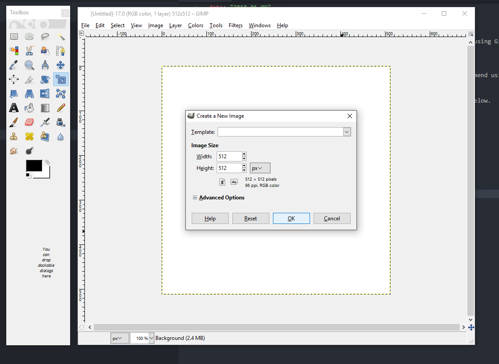
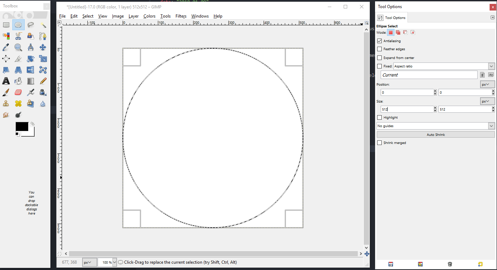
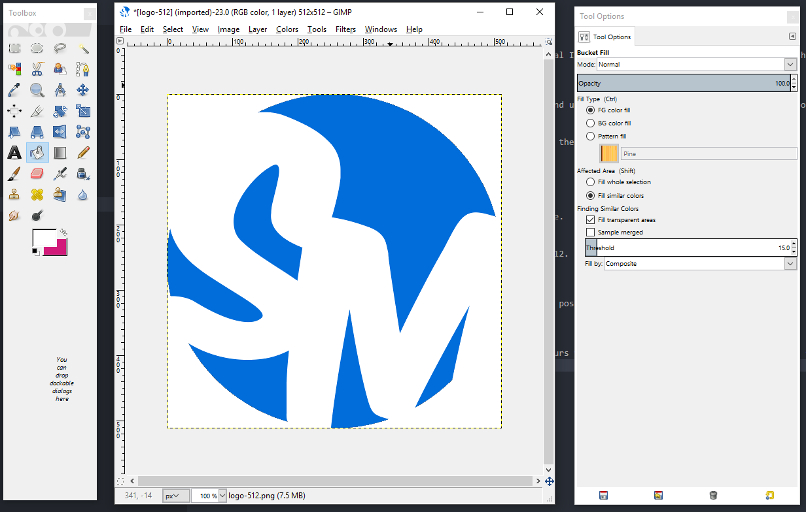
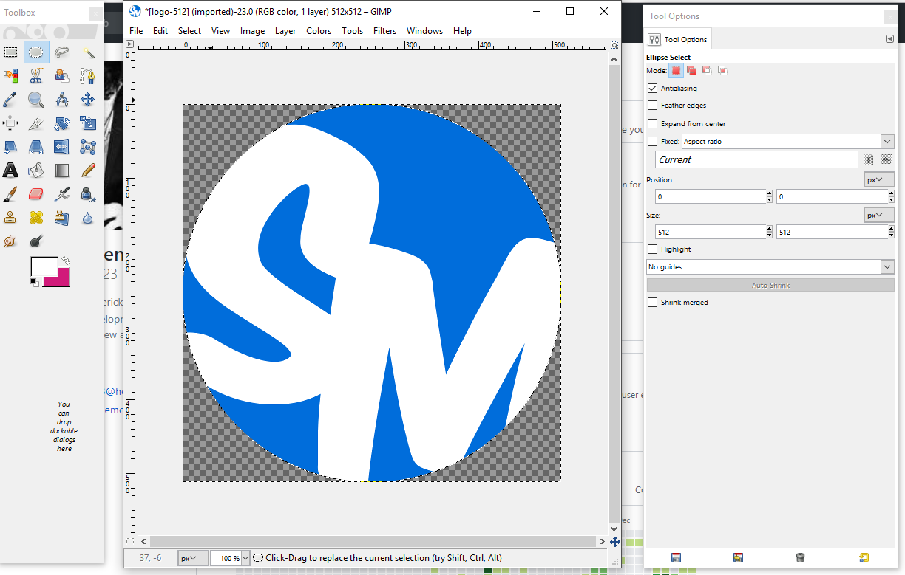

## Tools needed:
You will need an image editor to create the logo, in this tutorial I will be using Gimp. Which can be downloaded here: https://www.gimp.org/

## Step 1: Choose a color
We will first decide on the primary color for our logo. I recommend using a color tool to help you. This online tool should do the trick! http://paletton.com 

After fiddling with the color wheel for awhile I have decided on the color below.

####\#006ddb

## Step 2: Font
Head over to https://www.dafont.com/ and find a font you like.

## Step 3: Gimp 
#### Canvas
Now open up gimp and create a new image with dimensions of 512x512.

#### Logo Base
Double click the ellipse icon to open the tools options. Set the position to 0,0 and size to 512,512

### Add Color and Letters
Fill the circle with your chosen color and create two text layers with the initials of your name. Try different font sizes and move the letters around to find the best fit for your font. 

### Cut corners
Now we must cut the corners off. Simply make a circle like before (set the position to 0,0 and size to 512,512). Then navigate to Select > Invert. Then press the delete key.

### Export
Finally, we can export our new logo to PNG. I recommend making multiple sizes for use in different situations.